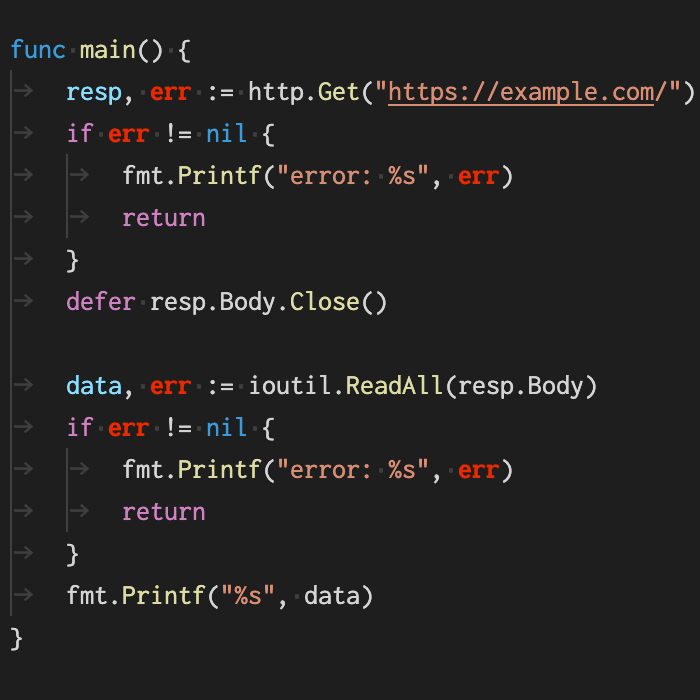

# go-err-highlighting

## Features

This extension highlights the error variables such as `err` and `errCh` in your Go source code.

   
|||
|---|---|
|Before|After|

## Extension Settings

You can define the highlight color of the error variables by adding editor.tokenColorCustomizations section to your `settings.js`.

```json
  "editor.tokenColorCustomizations": {
    "textMateRules": [
      {
        "scope": "keyword.err.go",
        "settings": {
          "foreground": "#DD3D05",
          "fontStyle": "bold",
        }
      }
    ]
  }
```
## Release Notes


### 0.0.1

Initial release
